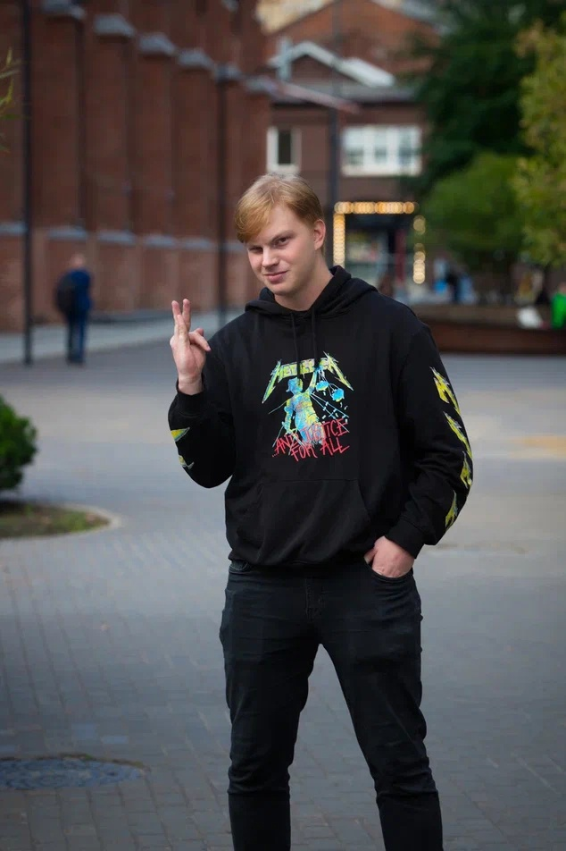

 <h1> Сидорчук Максим </h1> 

    

## Контакты

* +7 915 215 38 02
* sidorchuk.me@phystech.edu
* github.com/TupaToster

## Образование

* 10-11 физтех классы Курчатовской школы (без особого отличия, но и без долгов)
* 3 семестра ФРТК МФТИ со средним баллом 4.5 из 10
* Годовой курс Ильи Рудольфовича Дединского с баллом 4 из 10

## Проекты

* Простенький симулятор того, как работает процессор и ассемблер - https://github.com/TupaToster/wtfProc
* Программа расчета производной выражения - https://github.com/TupaToster/diff
* Пробный проект-исследование работы [simd инструкций](https://en.wikipedia.org/wiki/Single_instruction,_multiple_data) на примере альфа-блендинга изображений и рисования множества Мандельброта - https://github.com/TupaToster/SIMP
* Недописанный компилятор с-образного языка (написан только фронтенд - обработка кода, и немного бэкенда) - https://github.com/TupaToster/lang
* Симулятор архитектуры RISCV написанный на C++ - https://github.com/TupaToster/decode_lol

Стоит заметить, что все проекты сделаны в рамках курса информатики

## Навыки

* Знаю язык С, достаточно слабо python; неуверенный пользователь с++
* Примерно понимаю устройство компилятора
* Свободное владение английским языком (С1 по заключению кафедры иностранного языка мфти)
* Базовое (ниже А1) знание китайского и испанского (могу переводить тексты со словарем)

## Обо мне

Играю в группе на гитаре, учусь светорежиссуре в качестве хобби, более менее активно участвую в музыкальном движении на физтехе
